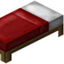

# Template Mod

Minecraft mod that Template Mod Description.

## Dependencies

### Required

- [Fabric API](https://modrinth.com/mod/fabric-api) or [Quilt Standard Libraries](https://modrinth.com/mod/qsl)
- [Architectury API](https://modrinth.com/mod/architectury-api)

### Optional

- [ModMenu](https://modrinth.com/mod/modmenu) for an in game configuration screen (only for singleplayer/LAN)

## Incompatibilities

[Create an issue](https://github.com/Steveplays28/realisticsleep/issues/new) on the issue tracker if you've found an incompatibility!

## Download

See the version info in the filename for the supported Minecraft versions.  
Made for the Fabric, Quilt, Forge, and NeoForge modloaders.  
TODO side.

## FAQ

- Q: Will you be backporting this to lower Minecraft versions?  
  A: No.

- Q: Does this mod work in multiplayer?  
  A: TODO.

- Q: Does only the server need this mod or does the client need it too?  
  A: TODO.

## Contributing

If you've encountered a problem or you want to suggest
features, [create an issue](https://github.com/templateorganization/templatemod/issues/new) on the issue tracker.

### Development

- `git clone https://github.com/templateorganization/templatemod.git`
- `cd templatemod`
- `./gradlew build`

## License

This project is licensed under LGPLv3,
see [LICENSE](https://github.com/templateorganization/templatemod/blob/1.20-1.20.1/LICENSE).
